

# AI in my art

[➤ tl;dr just show me the pictures](#artwork)

_2024-04_

I only really draw for fun, either just to render an interesting idea I have, or to figure out which parts of a character design make it attractive.  It usually only takes a couple strokes into the first sketch, for me to remember why I do computer science instead.

 lie down, (2) try not to cry, (3) cry a lot")

And this is just for black-and-white character sketches.  I've done some cleaning and coloring, but the final versions tend to make my lack of fundamentals even more apparent.  Animation is in a completely different league of hurt.

I've tried using AI for some of my work, but never found it useful for what I want to do (usually character art).  Text models never get the character concept in my mind, and can't carry over the parts it got right to the next iteration.  Sketch cleanup methods only understand the "roughness" they were trained for, not the specific way my sketches need cleaning.  Colorizers conflate coloring with effects, ignoring everything I want to invent things nobody asked for.  I'll put effort into running hacky research code, with barely functional (if existant) GUIs, only to find they solve problems different from mine.

Figuring out AI tooling just feels like a big distraction from the drawing I wanted to make.  As a casual, I'm not under any pressure to accelerate my workflow; as an amateur, my process isn't worth optimizing anyway.  I'd much rather spend my leisure time actually drawing the things I like.

I still can't draw digitally for the same reason; I'm here to figure out the visual mechanism by which a character affects our hearts, not the hotkeys...  As of this writing, all my artwork is still on paper.

<!-- Yes, I'm aware of the irony.  It's honestly a bit embarassing sometimes for me to ask artists to use my AI tool, when I can't even transition from paper to digital. -->

However, this is not to say that AI will never be useful to my art, nor to discredit the huge recent advancements in image generation.  Most of the amazing new methods are good for folks who don't know what they want, not for people who know what they need.  Systems built for the latter group simply haven't caught up yet.

Speaking more broadly about AI art, creating such systems for users needing high specificity is hard.  Sure there's [technical challenges](#footnote-tech), but I personally think the bigger barrier is communication between artists and researchers.

We researchers would need to \*gasp\* touch grass and interact with actual artists, instead of squatting in an ivory vacuum claiming to solve invented art challenges.  I encourage artists to set aside their prejudices and objectively understand the ways AI could help their own workflows, rather than giving in to general fearmongering.

Progress on these tools will only advance with open-mindedness and cooperation from both sides.  I'm incredibly greatful to be with artists who very patiently help me understand their work, and actively collaborate to improve the creative process.

Back to my personal use cases, I've for now decided to put aside developing AI for my own art, in favor of first supporting the people who actually know what they're doing and are producing content in [the medium that I love](/reviews).

In the future I might find enough commitment to draw my characters and stories onto a manga or something.  Maybe then out of necessity I'll finally figure out how to use hotkeys and AI.

Enough text, let's see some pictures

<!-- objects, proportions, posing/camera, line style, colors, shading -->

<!-- [pixiv account](https://www.pixiv.net/en/users/56056643)   -->
<!-- (may need to log-in to see all posts) -->

<!-- [fanart](#fanart)   -->
<!-- [original](#original)   -->
<!-- [exercises](#exercises)   -->

# artwork

## fanart

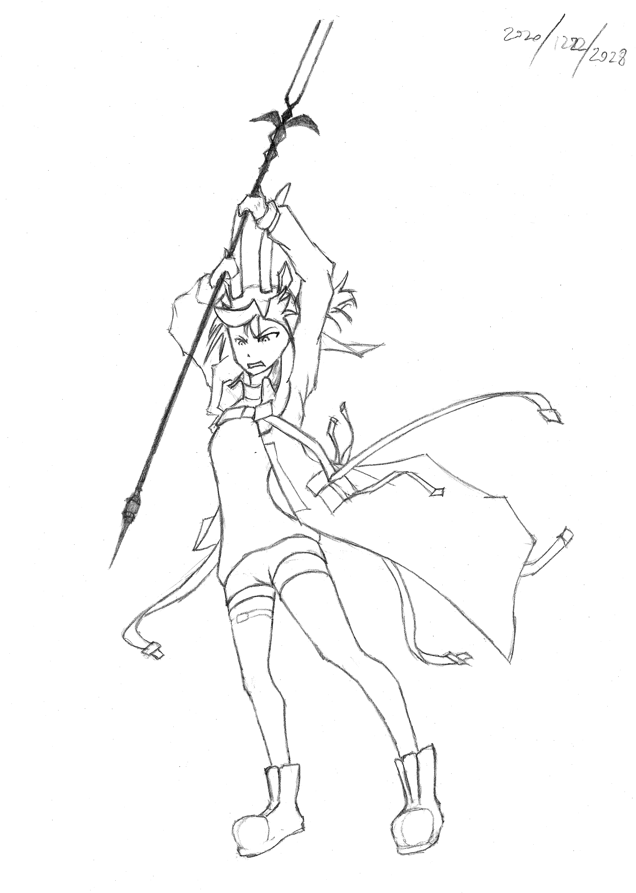

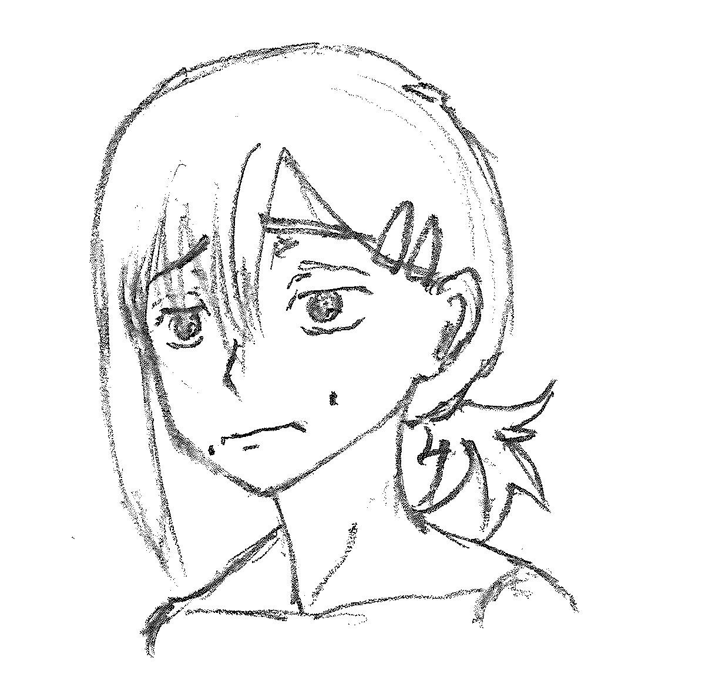

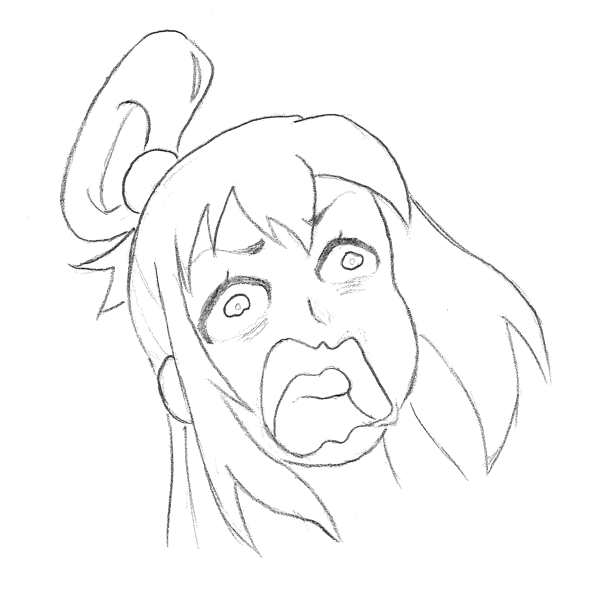
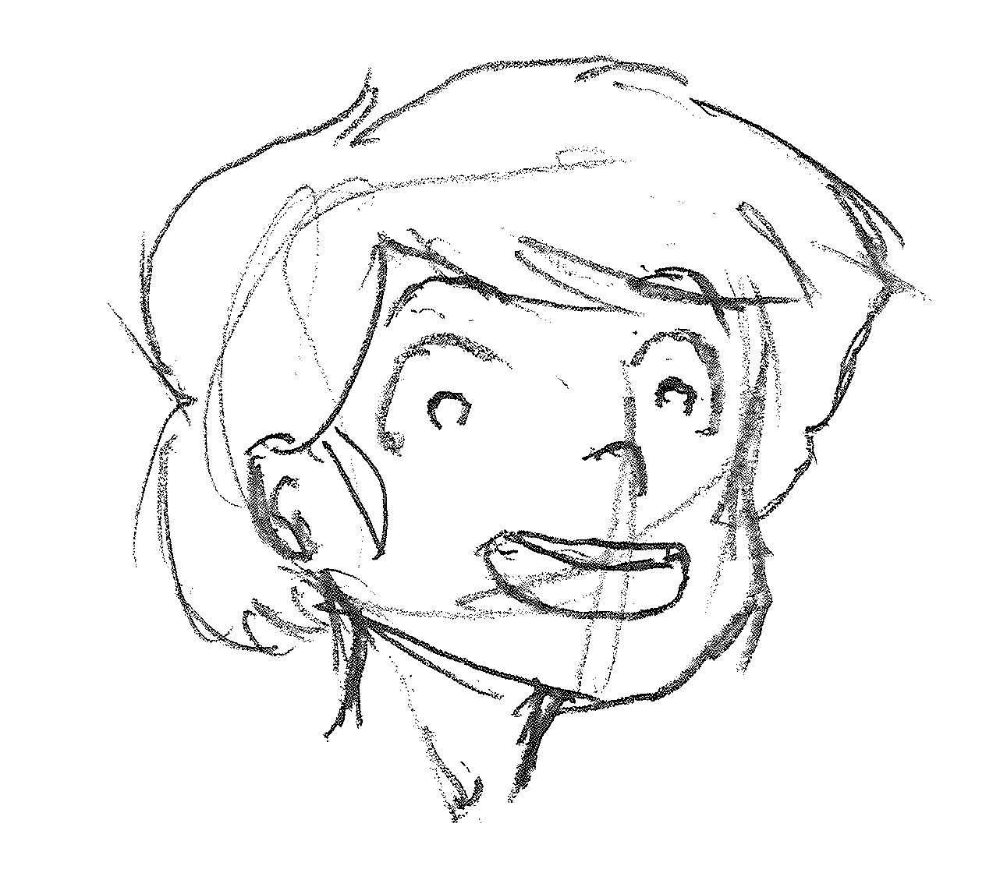

    
shiki spoiler

    

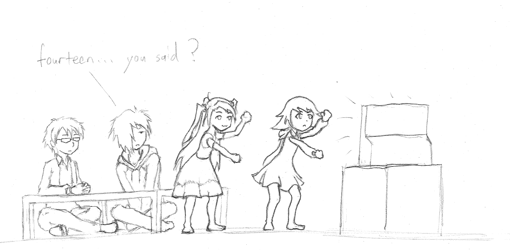

## original

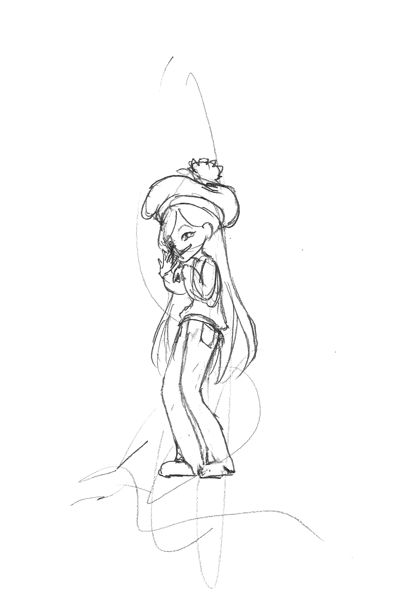
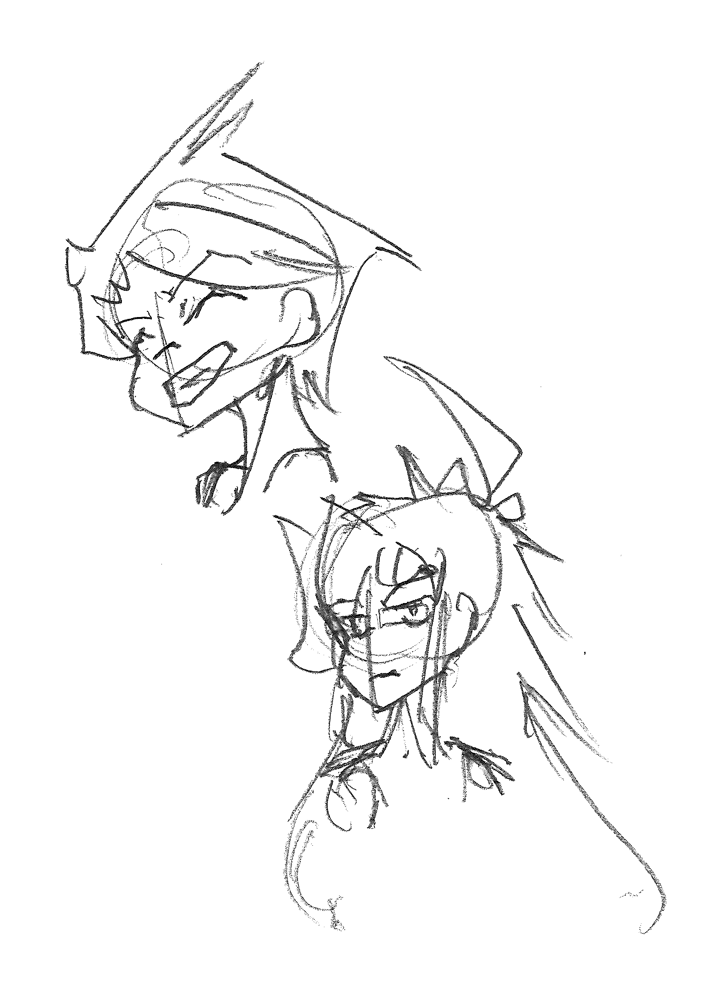
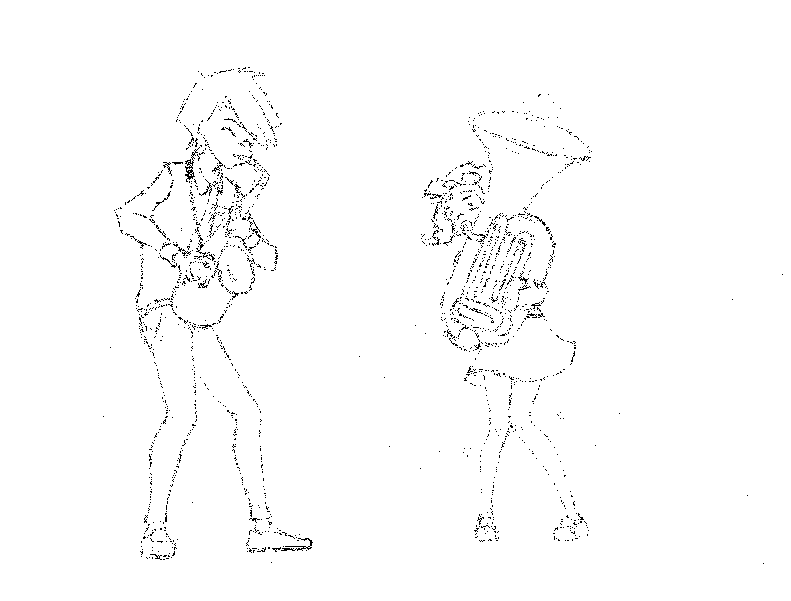
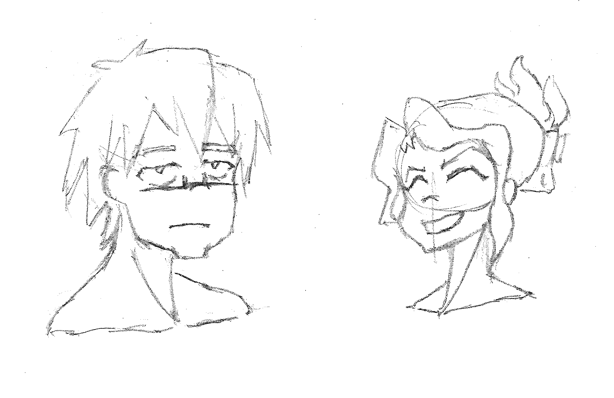

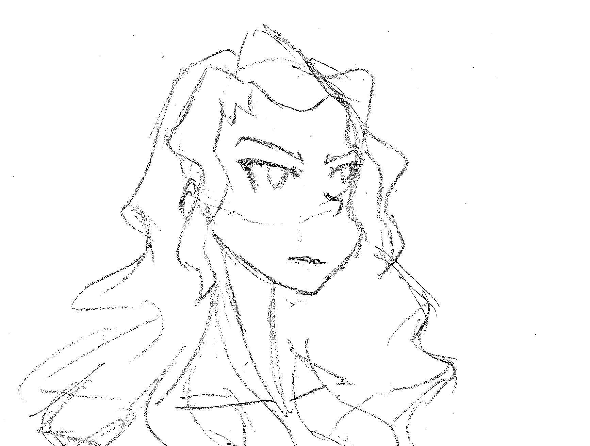

## exercises

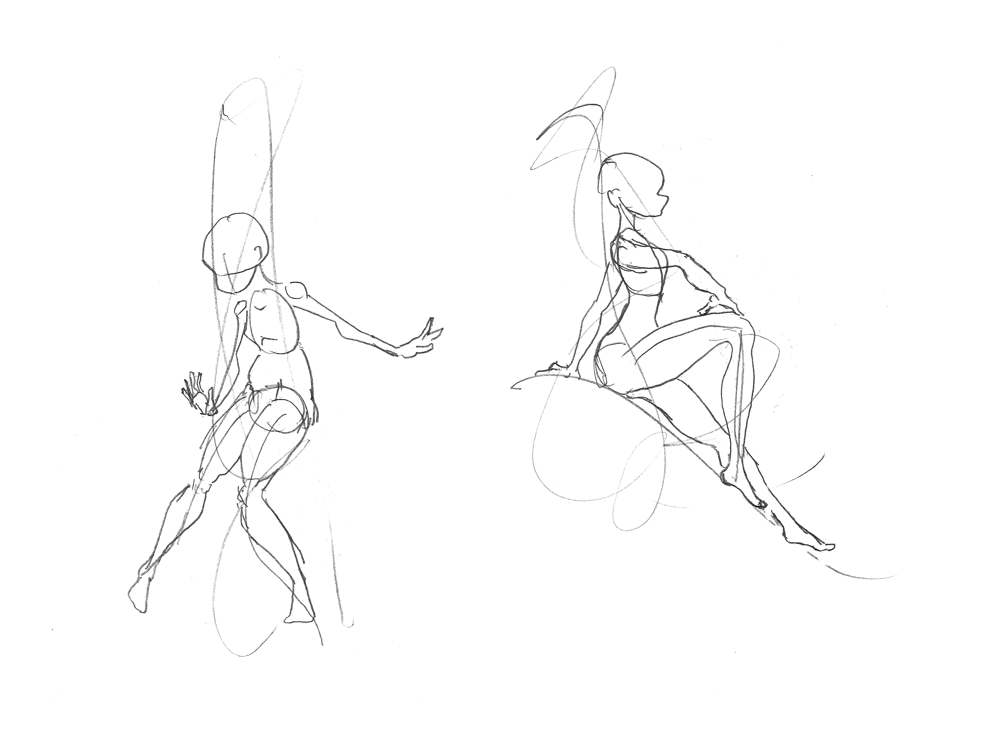

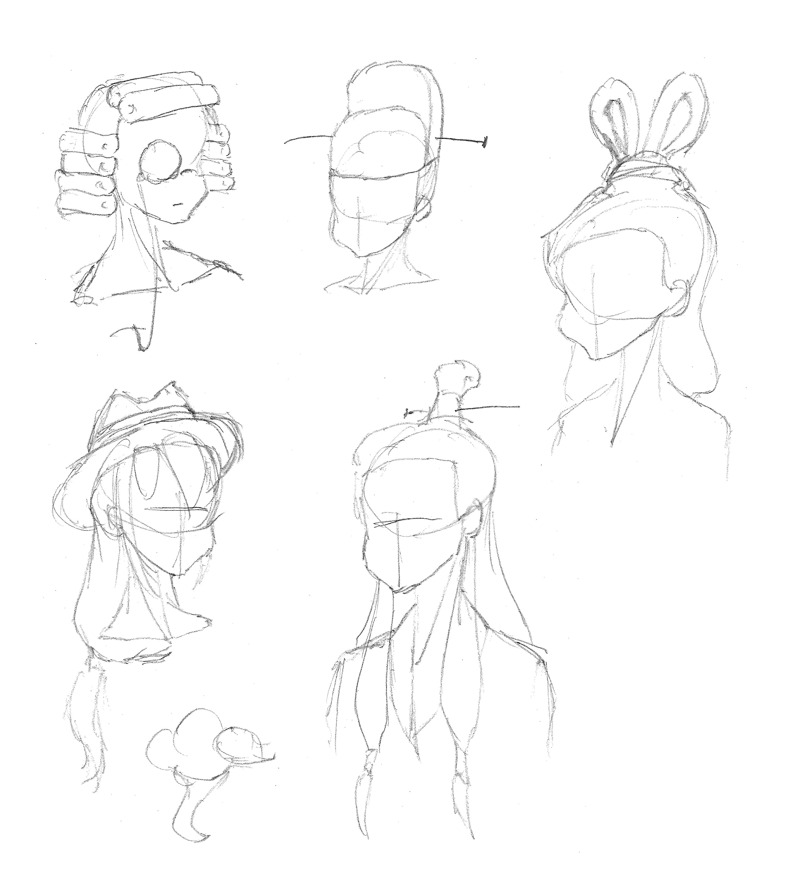

    
footnotes

    

        

            <i>[technical challenges]</i> From the technical perspective, high-quality generation is paradoxically harder given more conditioning.  For example, text-conditioned models only need to find a good mode within a huge swath of the image space satisfying the loose text requirement.  A more information-rich image condition would only allow for a comparative sliver of potential outputs.  One would think that extra information helps generation, but counter-intuitively it only restricts models to unfamiliar areas of image space.  This is worsened by the fact that highly-related data pairs are scarce; again with the text-vs-image example, useful caption datasets trump image translation sets by orders of magnitude.
            <!-- An extreme case of these technical challenges can be seen with sketch cleanup.   -->
        

    

