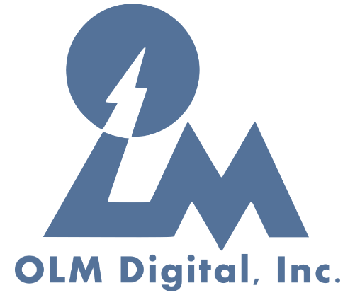

# experience

<table cellspacing='0' cellpadding='0' border='0'>
<tbody>
<tr>
    <td>
        
    </td>
    <td class=pad_xp>
        <label class=darktext>
            Founder, Dondon Technologies Inc.
        </label> 
        <i>
            Website: <a target='blank' href='https://www.dondontech.com/'>dondontech.com</a>
             
            2024 April – present
        </i> 
        Our goal at Dondon is to assist traditional 2D animators working in the Japanese anime pipeline.  Many labor-intensive tasks like douga and shiage (CUIB/DIP) can be accelerated with the help of new vision/graphics techniques.
    </td>
</tr>
<tr>
    <td>
        
    </td>
    <td class=pad_xp>
        <label class=darktext>
            PhD Graduate Research Assistant, UMD CS
        </label> 
        <i>
            Advisor: <a target='blank' href='https://www.cs.umd.edu/~zwicker/'>Prof. Matthias Zwicker</a>
             
            2020 June – 2024 June
             
            College Park, Maryland, USA
        </i> 
        I am exploring novel ways of creating and manipulating illustrations and animations, by leveraging both data-driven vision techniques and 3D graphics representations.  I am also interested in new rendering methods using deep learning. 
    </td>
</tr>
<tr>
    <td>
        
    </td>
    <td class=pad_xp>
        <label class=darktext>
            Research Scientist Intern, Meta
        </label> 
        <i>
            Mentors:
            <a target='blank' href='https://sites.google.com/view/amitumd/home'>Amit Kumar</a>,
            <a target='blank' href='https://engineering.purdue.edu/people/xiaoyu.xiang.1'>Xiaoyu Xiang</a>,
            <a target='blank' href='https://sreyas-mohan.github.io'>Sreyas Mohan</a>,
            <a target='blank' href='https://www.linkedin.com/in/rakesh-r-3848538/'>Rakesh Ranjan</a>
             
            2023 August – 2024 March
             
            Menlo Park, California, USA
        </i> 
        Worked on diffusion models applied to non-photorealistic 3D modeling topics.
    </td>
</tr>
<tr>
    <td>
        
    </td>
    <td class=pad_xp>
        <label class=darktext>
            Research Collaborator, OLM Digital Inc.
        </label> 
        <i>
            Supervisors:
            <a target='blank' href='https://www.linkedin.com/in/akinoubu-maejima-36257930/?originalSubdomain=jp'>Maejima Akinobu</a>,
            <a target='blank' href='https://www.researchgate.net/profile/Marc-Salvati'>Marc Salvati</a>,
            <a target='blank' href='https://www.linkedin.com/in/tatsuo-yotsukura-9969551/?originalSubdomain=jp'>Tatsuo Yotsukura</a>
             
            2023 July
             
            Setagaya, Tokyo, Japan
        </i> 
        Research & Development Division, worked on automatic cleanup of genga to douga.  Collaborated in-person in Setagaya, Tokyo to learn more about the anime production process, and to train deep models on real production data.
    </td>
</tr>
<tr>
    <td>
        
    </td>
    <td class=pad_xp>
        <label class=darktext>
            Visiting Researcher, Arch Inc.
        </label> 
        <i>
            Affiliate contact:
            <a target='blank' href='https://junkato.jp/'>Jun Kato</a>
             
            2023 January
             
            Yoyogi Shibuya, Tokyo, Japan (remote)
        </i> 
        Thanks to colleagues at <a target='blank' href='https://research.archinc.jp/en/'>Arch Inc.</a> for setting me up as a visiting researcher, to help foster collaboration with anime industry professionals in Japan.  Please direct Arch-related inquiries to shuhong[a]archinc.jp.
    </td>
</tr>
<tr>
    <td>
        
    </td>
    <td class=pad_xp>
        <label class=darktext>
            Vision Research Intern, ByteDance/TikTok
        </label> 
        <i>
            Mentors:
            <a target='blank' href='https://www.linkedin.com/in/yihengz'>Yiheng Zhu</a>,
            <a target='blank' href='https://hengcv.github.io/'>Heng Wang</a>,
            <a target='blank' href='https://seasonsh.github.io/'>Yichun Shi</a>,
            <a target='blank' href='https://www.linkedin.com/in/xiao-yang-46464934/'>Xiao Yang</a>
             
            2022 May – 2022 November
             
            Mountain View, California, USA (remote)
        </i> 
        Intelligent Creation & Computer Vision - Generation Team, worked on generative modeling of 3D VR character assets; specifically, stylized single-view 3D reconstruction from illustrated character portraits.
    </td>
</tr>
<tr>
    <td>
        
    </td>
    <td class=pad_xp>
        <label class=darktext>
            Summer Intern, MIT Lincoln Laboratory
        </label> 
        <i>
            Advisor: <a target='blank' href='https://www.linkedin.com/in/mikeschan/'>Dr. Michael Chan</a>
             
            2018 June – 2018 August
             
            Lexington, Massachusetts, USA
        </i> 
        I looked at automatically discovering recurrent neural network architectures for video action recognition.  I was also a finalist at the lab’s Intern Innovative Idea Challenge.
    </td>
</tr>
<tr>
    <td>
        
    </td>
    <td class=pad_xp>
        <label class=darktext>
            Undergrad Research Assistant, Rutgers ECE
        </label> 
        <i>
            Advisor: <a target='blank' href='https://www.ece.rutgers.edu/~marsic/'>Prof. Ivan Marsic</a>
             
            2015 October – 2019 May
             
            New Brunswick, New Jersey, USA
        </i> 
        I worked with grad students on healthcare informatics for trauma resuscitations; topics included process mining, workflow analysis, data visualization, NLP, and CV.
    </td>
</tr>
</tbody>
</table>

# education

Special thanks to [Prof. Matthew Stone](https://people.cs.rutgers.edu/~mdstone/){:target="_blank"}, [Prof. Iian Smythe](https://sites.google.com/site/iiansmythe/){:target="_blank"}, and [Prof. Qiang Xu](https://www.linkedin.com/in/qiang-xu-3316b5193/){:target="_blank"} for their invaluable guidance and mentorship.

<table cellspacing='0' cellpadding='0' border='0'>
<tbody>
<tr>
    <td>
        
    </td>
    <td class=pad_edu>
        <label class=darktext>
            University of Maryland - College Park, MD 
        </label>
        <i>
            PhD in CS 
        </i>
        Class of 2024 (expected) 
        Advisor: <a target='blank' href='https://www.cs.umd.edu/~zwicker/'>Prof. Matthias Zwicker</a>
    </td>
</tr>
<tr>
    <td>
        
    </td>
    <td class=pad_edu>
        <label class=darktext>
            Rutgers University, NJ 
        </label>
        <i>
            BS in CS and Math, minor in Econ 
        </i>
        Class of 2019, Honors College Inaugural Class 
        Summa cum laude
    </td>
</tr>
</tbody>
</table>

# teaching + mentorship

<label class=darktext>MS students advised:</label>  
2022: Eric Changzhi Li, Srinidhi Hegde  
2021: Janus Thor Kristjansson, Jiaxuan Mary Wu  

<label class=darktext>BS students advised:</label>  
2022: Andy Qu  
2020: Nikhil Pateel  

<label class=darktext>classes taught:</label>  
M2021 UMD AI4ALL Project Lead: Making Art with Neural Networks  
S2020 TA CMSC417: Computer Networks, Prof. Nirupam Roy, UMD  
F2019 TA CMSC132: OOP II, Prof. Nelson Pauda-Perez and Pedram Sadeghian, UMD  
2016-2019 Lecturer, ML/AI Division Director, Rutgers IEEE E-Board  
2016 Tutor, Math & Engineering, Rutgers OSS Educational Opportunity Fund  
2013-2016 TA Chinese Second Language, Huaxia Morris Chinese Academy  

# invited talks

- 2023 July, University of Tokyo, Takeo Igarashi Lab, "ML for Anime: Illustration, Animation, and 3D Models"
- 2023 March, Chimera Entertainment, "What are Generative Image Models?"

# awards

- 2024 Pitch Dingman Semi-finalist, UMD Smith School of Business
- 2023 Startup Fellow, UMD Startup Shell

- 2021 Honorable Mention, NSF GRFP (graduate)
- 2019 Honorable Mention, NSF GRFP (undergrad)
- 2019 Dean’s Fellowship, UMD Graduate School of CS
- 2019 Startup Allocation Proposal, XSEDE PSC Bridges
- 2018 Alan Marc Schreiber Memorial Scholarship, Rutgers SAS Excellence Award in Math
- 2017 Grant for Conference Funding, Aresty Research Center
- 2017 Grant for Conference Funding, Rutgers ECE
- 2015 Rutgers Trustee Scholarship, Rutgers University

- 2018 Top 6 Shark-Tank Finalist, MIT Intern Innovative Idea Challenge
- 2017 Best Healthcare Hack, HackRU F2017
- 2017 Best Use of Machine Learning (4th), HackRU F2017

- 2021: nominated for Sigma Xi Associate Membership
- 2018: member of Phi Beta Kappa Honors Society
- 2017: member of IEEE

