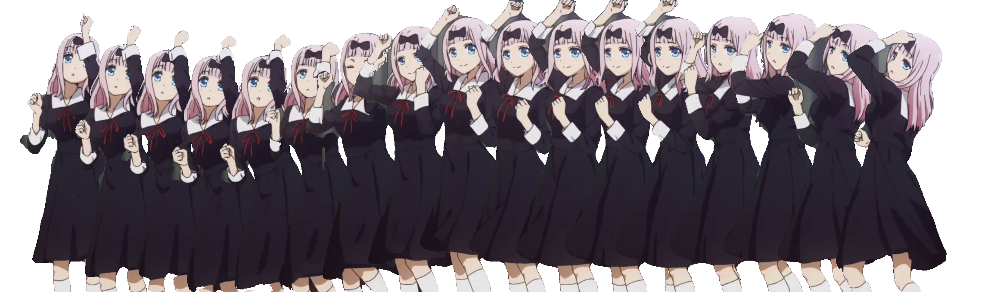
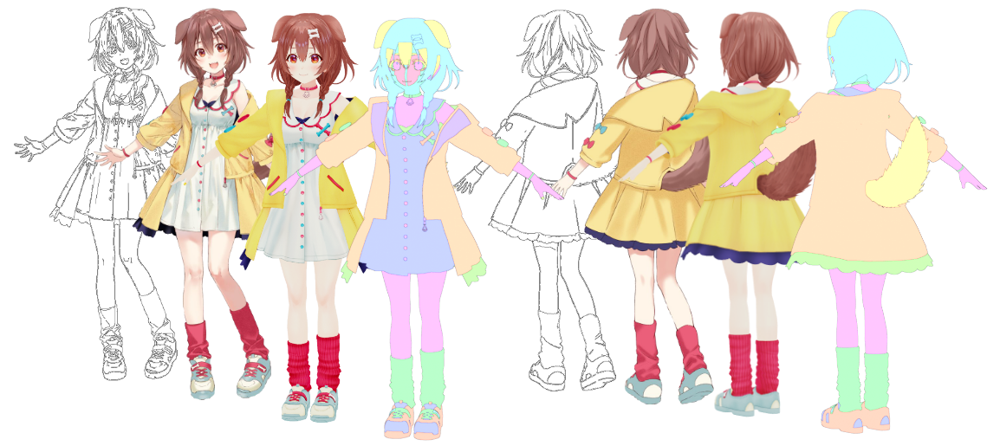
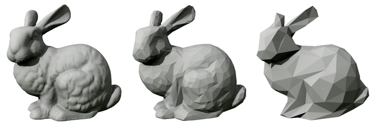

# shu

I'm shu, a comp sci PhD student at University of Maryland - College Park under [Prof. Matthias Zwicker](https://www.cs.umd.edu/~zwicker/); I entered 2019, and plan to graduate 2024.  I'm also a visiting researcher at [Arch Inc., JP](https://research.archinc.jp/en/).

My [research](./publications) uses graphics and computer vision techniques for non-photorealistic content creation, with emphasis on animated, illustrated, and 3D characters.

I like anime; my favorite is [Nichijou (2011)](https://myanimelist.net/anime/10165/Nichijou).  To trash on my taste, please see my [mal profile](https://myanimelist.net/profile/shuchen) or my [top anime page](./reviews).

This site is incomplete; for more shu, please see the [latest cv](./assets/documents/cv_shuhong_chen.pdf).

# research

<small>
    <!-- chika requiem -->
    [<a href='https://www.youtube.com/watch?v=-rokG9XS37w'>sauce</a>]
    [<a href='https://www.semanticscholar.org/paper/Transfer-Learning-for-Pose-Estimation-of-Characters-Chen-Zwicker/b6cf0b44134a91f70dfb8db500d48fd9bde6150d'>model</a>]
</small>

<!-- 
<small>[sauce] [sauce] [sauce]</small>
 -->

<b class=darktext>AI-assisted animation</b>.  Traditional animation is laborious.  To create the expressive motions loved by [millions](https://www.crunchyroll.com/anime-news/2021/02/02/crunchyroll-reaches-four-million-subscribers), professional and amateur animators alike face the intrinsic cost of \~12 illustrations per second.  As the medium rapidly enters [mainstream](https://about.netflix.com/en/news/netflix-animeslate), the sheer manual line-mileage demanded continues to increase.  This begs the question of whether modern data-driven computer vision methods can offer automation or assist the creative process.  While some work exists for [colorization](https://www.semanticscholar.org/paper/Two-Stage-Sketch-Colorization-With-Color-Parsing-Ren-Li/e27cdd0f144b9045608f7772b3ac4b6d7ba90b0f), [cleanup](https://www.semanticscholar.org/paper/Mastering-Sketching-Simo-Serra-Iizuka/17f3f14c5e57462087b7cb6fee51567ade481e37), [in-betweening](https://www.semanticscholar.org/paper/Deep-Animation-Video-Interpolation-in-the-Wild-Li-Zhao/701c56592f6b4132f5869f175a46c88df12a3340), etc., we're still missing foundational domain-specific infrastructure to train models at scale.  Many models for illustration [tagging](https://rf5.github.io/2019/07/08/danbuuro-pretrained.html), [pose](https://www.semanticscholar.org/paper/Pose-estimation-of-anime%2Fmanga-characters%3A-a-case-Khungurn-Chou/a730e711f703f40a0c5e21854c928ed79df45872), [sketch extraction](https://github.com/lllyasviel/sketchKeras), [segmentation](https://github.com/zymk9/Yet-Another-Anime-Segmenter), etc. are still in their infancy.  By studying animation industry practices, scaling data pipelines, bridging domain gaps, leveraging 3d priors, etc., I hope to uncover what AI can do for animation.

<small>
    <!-- yubiyubi -->
    [<a href='https://twitter.com/fuka_hire/status/1122120707683471360'>sauce</a>]
    [<a href='https://3d.nicovideo.jp/works/td63650'>sauce</a>]
</small>

<b class=darktext>3d character modeling</b>.  While 3d human priors are crucial for the above animation topic (form and surface anatomy are animator fundamentals), 3d character modeling itself may also benefit from new techniques.  As [AR/VR apps](https://hello.vrchat.com/) and [virtual creators](https://www.mmd.hololive.tv/) become more popular, there will soon be major demand for stylized 3d avatars.  But current [template](https://www.mixamo.com/#/)-[based](https://store.steampowered.com/app/1073440/__Koikatsu_Party/) [designers](https://vroid.com/en/studio) are restrictive, with custom assets still requiring [expert software](https://www.blender.org/) to create.  Recent works use [implicit reconstruction](https://www.semanticscholar.org/paper/PIFu%3A-Pixel-Aligned-Implicit-Function-for-Clothed-Saito-Huang/343da6d4cff7ce8c04270487a1f7a037ea0572d6), [differentiable rendering](https://www.semanticscholar.org/paper/Do-2D-GANs-Know-3D-Shape-Unsupervised-3D-shape-from-Pan-Dai/7d7d189796efa8fbd3f516b183954bc36f262f3f), [3d pose](https://www.semanticscholar.org/paper/ARCH%3A-Animatable-Reconstruction-of-Clothed-Humans-Huang-Xu/0ff2c939d136df8988f845ae5cdfb725939a82ab) etc. to create realistic 3d humans, but comparatively little has been done to suit the design challenges of non-photorealistic characters.  My work tries to democratize 3d character creation, bringing customizable experiences to the next generation of social interaction.

<small>
    [<a href='https://en.wikipedia.org/wiki/File:Stanford_bunny_qem.png'>source</a>]
</small>

<b class=darktext>Deep rendering</b>.  I firmly believe [graphics is the future of computer vision](./philosophy#graphics-is-the-future-of-computer-vision).  As such, I'm also interested in new 3d representations and rendering techniques, whether it be novel ways of solving the [rendering equation](https://www.semanticscholar.org/paper/Neural-Radiosity-Hadadan-Chen/94261c7cb0d991f4137f55783f76b1f67810366e) or the [implicit stuff](https://www.semanticscholar.org/paper/NeRF%3A-Representing-Scenes-as-Neural-Radiance-Fields-Mildenhall-Srinivasan/428b663772dba998f5dc6a24488fff1858a0899f) everyone's so hyped about.

<!-- 
# publications

Please see the [publications page](./publications); full list on [google scholar](https://scholar.google.com/citations?hl=en&user=TcGJKGwAAAAJ&view_op=list_works&sortby=pubdate).
 -->

