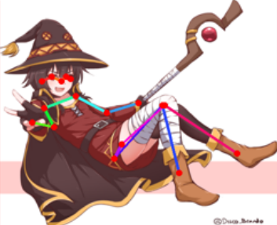

I'm shu, a comp sci PhD student at University of Maryland - College Park under [Prof. Matthias Zwicker](https://www.cs.umd.edu/~zwicker/); I entered 2019, and plan to graduate 2024.

My [research](https://scholar.google.com/citations?hl=en&user=TcGJKGwAAAAJ&view_op=list_works&sortby=pubdate) uses graphics and computer vision techniques for non-photorealistic content creation, with emphasis on animated, illustrated, and 3D characters.

I like anime; my favorite is [Nichijou (2011)](https://myanimelist.net/anime/10165/Nichijou).  To trash on my taste, please see my [mal](https://myanimelist.net/profile/shuchen).
<!-- or my top show [reviews](./reviews). -->

This site is incomplete; for more shu, please see the [full cv](./assets/documents/cv_shuhong_chen.pdf).

## research

<small>
    <!-- chika requiem -->
    [<a href='https://www.youtube.com/watch?v=-rokG9XS37w'>sauce</a>]
    [<a href='https://www.semanticscholar.org/paper/Transfer-Learning-for-Pose-Estimation-of-Characters-Chen-Zwicker/b6cf0b44134a91f70dfb8db500d48fd9bde6150d'>model</a>]
</small>

<!-- 
<small>[sauce] [sauce] [sauce]</small>
 -->

<b class=darktext>AI-assisted animation</b>.  Traditional animation is laborious.  To create the expressive motions loved by [millions](https://www.crunchyroll.com/anime-news/2021/02/02/crunchyroll-reaches-four-million-subscribers), professional and amateur animators alike face the intrinsic cost of \~12 illustrations per second.  As the medium rapidly enters [mainstream](https://about.netflix.com/en/news/netflix-animeslate), the sheer line-mileage demanded has even led to [incredibly unfortunate](https://www.nytimes.com/2021/02/24/business/japan-anime.html) work standards.  This begs the question of whether modern data-driven computer vision methods can offer automation without losing creative control.  While some work exists for [colorization](https://www.semanticscholar.org/paper/Two-Stage-Sketch-Colorization-With-Color-Parsing-Ren-Li/e27cdd0f144b9045608f7772b3ac4b6d7ba90b0f), [cleanup](https://www.semanticscholar.org/paper/Mastering-Sketching-Simo-Serra-Iizuka/17f3f14c5e57462087b7cb6fee51567ade481e37), [in-betweening](https://www.semanticscholar.org/paper/Deep-Animation-Video-Interpolation-in-the-Wild-Li-Zhao/701c56592f6b4132f5869f175a46c88df12a3340), etc., we're still missing foundational domain-specific infrastructure to train models at scale.  Many models for illustration [tagging](https://rf5.github.io/2019/07/08/danbuuro-pretrained.html), [pose](https://www.semanticscholar.org/paper/Pose-estimation-of-anime%2Fmanga-characters%3A-a-case-Khungurn-Chou/a730e711f703f40a0c5e21854c928ed79df45872), [sketch extraction](https://github.com/lllyasviel/sketchKeras), [segmentation](https://github.com/zymk9/Yet-Another-Anime-Segmenter), etc. are still in their infancy.  By studying animation industry practices, scaling pipelines, collecting data, bridging domain gaps, leveraging 3d priors, etc., I hope to make AI-assisted animation a reality.

<small>
    <!-- yubiyubi -->
    [<a href='https://twitter.com/fuka_hire/status/1122120707683471360'>sauce</a>]
    [<a href='https://3d.nicovideo.jp/works/td63650'>sauce</a>]
</small>

<b class=darktext>3d character modeling</b>.  While 3d human priors are crucial for the above animation topic (form and surface anatomy are animator fundamentals), 3d character modeling itself may also benefit from new techniques.  As [AR/VR apps](https://hello.vrchat.com/) and [virtual creators](https://www.mmd.hololive.tv/) become more popular, there will soon be major demand for stylized 3d avatars.  But current [template](https://www.mixamo.com/#/)-[based](https://store.steampowered.com/app/1073440/__Koikatsu_Party/) [designers](https://vroid.com/en/studio) are restrictive, with custom assets still requiring [expert software](https://www.blender.org/) to create.  Recent works use [implicit reconstruction](https://www.semanticscholar.org/paper/PIFu%3A-Pixel-Aligned-Implicit-Function-for-Clothed-Saito-Huang/343da6d4cff7ce8c04270487a1f7a037ea0572d6), [differentiable rendering](https://www.semanticscholar.org/paper/Do-2D-GANs-Know-3D-Shape-Unsupervised-3D-shape-from-Pan-Dai/7d7d189796efa8fbd3f516b183954bc36f262f3f), [3d pose](https://www.semanticscholar.org/paper/ARCH%3A-Animatable-Reconstruction-of-Clothed-Humans-Huang-Xu/0ff2c939d136df8988f845ae5cdfb725939a82ab) etc. to create realistic 3d humans, but comparatively little has been done to suit the design challenges of non-photorealistic characters.  My work tries to democratize 3d character creation, bringing customizable experiences to the next generation of social interaction.

<small>
    [<a href='https://en.wikipedia.org/wiki/File:Stanford_bunny_qem.png'>source</a>]
</small>

<b class=darktext>Deep rendering</b>.  I firmly believe [graphics is the future of computer vision](./philosophy#graphics-is-the-future-of-computer-vision).  As such, I'm also interested in new 3d representations and rendering techniques, whether it be novel ways of solving the [rendering equation](https://www.semanticscholar.org/paper/Neural-Radiosity-Hadadan-Chen/94261c7cb0d991f4137f55783f76b1f67810366e) or the [implicit stuff](https://www.semanticscholar.org/paper/NeRF%3A-Representing-Scenes-as-Neural-Radiance-Fields-Mildenhall-Srinivasan/428b663772dba998f5dc6a24488fff1858a0899f) everyone's so hyped about.

## publications

This list includes only 1st/2nd-authorships; full list on [google scholar](https://scholar.google.com/citations?hl=en&user=TcGJKGwAAAAJ&view_op=list_works&sortby=pubdate)

<table cellspacing='0' cellpadding='0' border='0'>
<tbody>
<tr>
    <td>
        
    </td>
    <td class=pad_pubs>
        <label class=darktext>
            Transfer Learning for Pose Estimation of Illustrated Characters 
        </label>
        <i>
            <b>S Chen</b>,
            M Zwicker
             
        </i>
        WACV2022 (to appear)
         
        [<a href='https://arxiv.org/abs/2108.01819'>arxiv</a>]
        [<a href='https://www.semanticscholar.org/paper/Transfer-Learning-for-Pose-Estimation-of-Characters-Chen-Zwicker/b6cf0b44134a91f70dfb8db500d48fd9bde6150d'>ss</a>]
        [web]
        [code, data]
        <!-- [<a href='https://shuhongchen.github.io/bizarre-pose-estimator/'>web</a>] -->
        <!-- [<a href='https://github.com/ShuhongChen/bizarre-pose-estimator/'>code, data</a>] -->
        <small>[<a href='https://www.pixiv.net/en/artworks/67179030'>sauce</a>]</small>
        <!-- <small>[<a href='https://danbooru.donmai.us/posts/3014412'>sauce</a>]</small> -->
    </td>
</tr>
<tr>
    <td>
        
    </td>
    <td class=pad_pubs>
        <label class=darktext>
            Neural Radiosity 
        </label>
        <i>
            S Hadadan,
            <b>S Chen</b>,
            M Zwicker
             
        </i>
        (under review, conditionally accepted)
         
        [<a href='https://arxiv.org/abs/2105.12319'>arxiv</a>]
        [<a href='https://www.semanticscholar.org/paper/Neural-Radiosity-Hadadan-Chen/94261c7cb0d991f4137f55783f76b1f67810366e'>ss</a>]
        [web]
        [code]
    </td>
</tr>
<tr>
    <td>
        
    </td>
    <td class=pad_pubs>
        <label class=darktext>
            Process-oriented Iterative Multiple Alignment for Medical Process Mining 
        </label>
        <i>
            <b>S Chen</b>,
            S Yang,
            M Zhou,
            R Burd,
            I Marsic
             
        </i>
        ICDM2017 DMBIH
         
        [<a href='https://arxiv.org/abs/1709.05440'>arxiv</a>]
        [<a href='https://www.semanticscholar.org/paper/Process-Oriented-Iterative-Multiple-Alignment-for-Chen-Yang/8bf6a42d6ec4d76152f87438e1caaa4d5344148b'>ss</a>]
    </td>
</tr>
</tbody>
</table>

## experience

<table cellspacing='0' cellpadding='0' border='0'>
<tbody>
<tr>
    <td>
        
    </td>
    <td class=pad_xp>
        <label class=darktext>
            PhD Research Assistant, UMD CS
        </label> 
        <i>
            Advisor: <a href='https://www.cs.umd.edu/~zwicker/'>Prof. Matthias Zwicker</a>
             
            2020 June – present
        </i> 
        I am exploring novel ways of creating and manipulating illustrations and animations, by leveraging both data-driven vision techniques and 3D graphics representations.  I am also interested in new rendering methods using deep learning. 
    </td>
</tr>
<tr>
    <td>
        
    </td>
    <td class=pad_xp>
        <label class=darktext>
            Summer Intern, MIT Lincoln Laboratory
        </label> 
        <i>
            Advisor: <a href='https://www.linkedin.com/in/mikeschan/'>Dr. Michael Chan</a>
             
            2018 June – 2018 August
        </i> 
        I looked at automatically discovering recurrent neural network architectures for video action recognition.  I was also a finalist at the lab’s Intern Innovative Idea Challenge.
    </td>
</tr>
<tr>
    <td>
        
    </td>
    <td class=pad_xp>
        <label class=darktext>
            Undergrad Research Assistant, Rutgers ECE
        </label> 
        <i>
            Advisor: <a href='https://www.ece.rutgers.edu/~marsic/'>Prof. Ivan Marsic</a>
             
            2015 October – 2019 May
        </i> 
        I worked with grad students on healthcare informatics for trauma resuscitations; topics included process mining, workflow analysis, data visualization, NLP, and CV.
    </td>
</tr>
</tbody>
</table>

## education

Special thanks to [Prof. Matthew Stone](https://people.cs.rutgers.edu/~mdstone/) and [Prof. Iian Smythe](https://sites.google.com/site/iiansmythe/) for their invaluable guidance and mentorship.

<table cellspacing='0' cellpadding='0' border='0'>
<tbody>
<tr>
    <td>
        
    </td>
    <td class=pad_edu>
        <label class=darktext>
            University of Maryland - College Park, MD 
        </label>
        <i>
            PhD in CS 
        </i>
        Class of 2024 (expected) 
        Advisor: <a href='https://www.cs.umd.edu/~zwicker/'>Prof. Matthias Zwicker</a>
    </td>
</tr>
<tr>
    <td>
        
    </td>
    <td class=pad_edu>
        <label class=darktext>
            Rutgers University, NJ 
        </label>
        <i>
            BS in CS and Math, minor in Econ 
        </i>
        Class of 2019, Honors College Inaugural Class 
        Summa cum laude
    </td>
</tr>
</tbody>
</table>

## awards

- 2021 Honorable Mention, NSF GRFP (graduate)
- 2019 Honorable Mention, NSF GRFP (undergrad)
- 2019 Dean’s Fellowship, UMD Graduate School of CS
- 2018 Alan Marc Schreiber Memorial Scholarship, Rutgers SAS Excellence Award in Math
- 2015 Rutgers Trustee Scholarship, Rutgers University

- 2019 Startup Allocation Proposal, XSEDE PSC Bridges
- 2017 Grant for Conference Funding, Aresty Research Center
- 2017 Grant for Conference Funding, Rutgers ECE

- 2018 Top 6 Shark-Tank Finalist, MIT Intern Innovative Idea Challenge
- 2017 Best Healthcare Hack, HackRU F2017
- 2017 Best Use of Machine Learning (4th), HackRU F2017

- 2021: nominated for Sigma Xi Associate Membership
- 2018: member of Phi Beta Kappa Honors Society
- 2017: member of IEEE

