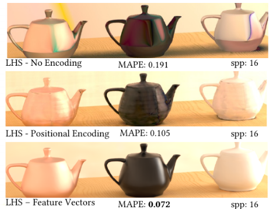
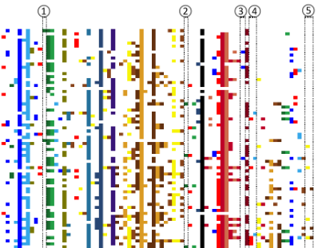

# publications

The best full list is on [google scholar](https://scholar.google.com/citations?hl=en&user=TcGJKGwAAAAJ&view_op=list_works&sortby=pubdate); the lists on [semanticscholar](https://www.semanticscholar.org/author/Shuhong-Chen/1804228) and [dblp](https://dblp.org/pid/35/1949.html) aren't as complete.

### 1st/2nd author

<table cellspacing='0' cellpadding='0' border='0'>
<tbody>
<tr>
    <td>
        
    </td>
    <td class=pad_pubs>
        <label class=darktext>
            Transfer Learning for Pose Estimation of Illustrated Characters 
        </label>
        <i>
            <b>S Chen</b>,
            M Zwicker
             
        </i>
        WACV2022 (to appear)
         
        [<a href='https://arxiv.org/abs/2108.01819'>arxiv</a>]
        [<a href='https://www.semanticscholar.org/paper/Transfer-Learning-for-Pose-Estimation-of-Characters-Chen-Zwicker/b6cf0b44134a91f70dfb8db500d48fd9bde6150d'>ss</a>]
        [web]
        [code, data]
        <!-- [<a href='https://shuhongchen.github.io/bizarre-pose-estimator/'>web</a>] -->
        <!-- [<a href='https://github.com/ShuhongChen/bizarre-pose-estimator/'>code, data</a>] -->
        <small>[<a href='https://www.pixiv.net/en/artworks/67179030'>sauce</a>]</small>
        <!-- <small>[<a href='https://danbooru.donmai.us/posts/3014412'>sauce</a>]</small> -->
    </td>
</tr>
<tr>
    <td>
        
    </td>
    <td class=pad_pubs>
        <label class=darktext>
            Neural Radiosity 
        </label>
        <i>
            S Hadadan,
            <b>S Chen</b>,
            M Zwicker
             
        </i>
        (under review, conditionally accepted)
         
        [<a href='https://arxiv.org/abs/2105.12319'>arxiv</a>]
        [<a href='https://www.semanticscholar.org/paper/Neural-Radiosity-Hadadan-Chen/94261c7cb0d991f4137f55783f76b1f67810366e'>ss</a>]
        [web]
        [code]
    </td>
</tr>
<tr>
    <td>
        
    </td>
    <td class=pad_pubs>
        <label class=darktext>
            Process-oriented Iterative Multiple Alignment for Medical Process Mining 
        </label>
        <i>
            <b>S Chen</b>,
            S Yang,
            M Zhou,
            R Burd,
            I Marsic
             
        </i>
        ICDM2017 DMBIH
         
        [<a href='https://arxiv.org/abs/1709.05440'>arxiv</a>]
        [<a href='https://www.semanticscholar.org/paper/Process-Oriented-Iterative-Multiple-Alignment-for-Chen-Yang/8bf6a42d6ec4d76152f87438e1caaa4d5344148b'>ss</a>]
    </td>
</tr>
</tbody>
</table>

### 3rd+ author

    

        <label class=darktext>
            Residual Recurrent Neural Network for Speech Enhancement 
        </label>
        <i>
            J Abdulbaqi, Y Gu,
            <b>S Chen</b>,
            I Marsic 
        </i>
        ICASSP2020
        [<a href='https://www.semanticscholar.org/paper/Residual-Recurrent-Neural-Network-for-Speech-Abdulbaqi-Gu/111586a5f814d43205ddf32b2dac1d09a0d6c006'>ss</a>]
        [<a href='https://ieeexplore.ieee.org/document/9053544'>ieee</a>]
    

    

        <label class=darktext>
            Mutual correlation attentive factors in dyadic fusion networks for speech emotion recognition 
        </label>
        <i>
            Y Gu, X Lyu, W Sun, W Li, 
            <b>S Chen</b>,
            X Li, I Marsic
             
        </i>
        ACMMM2019
        [<a href='https://www.semanticscholar.org/paper/Mutual-Correlation-Attentive-Factors-in-Dyadic-for-Gu-Lyu/4c60d8c4c8464bc41d894353f5c09e885df366fe'>ss</a>]
        [<a href='https://dl.acm.org/doi/10.1145/3343031.3351039'>acm</a>]
        [<a href='https://github.com/XinyuLyu/Mutual-Correlation-Attentive-Factors-in-Dyadic-Fusion-Networks-for-Speech-Emotion-Recognition'>code</a>]
    

    

        <label class=darktext>
            Multimodal attention network for trauma activity recognition from spoken language and environmental sound 
        </label>
        <i>
            Y Gu, R Zhang, X Zhao, 
            <b>S Chen</b>,
            J Abdulbaqi, I Marsic, M Cheng, RS Burd  
        </i>
        ICHI2019
        [<a href='https://www.semanticscholar.org/paper/Multimodal-Attention-Network-for-Trauma-Activity-Gu-Zhang/df88420f4d7b76db5afca4cb9893a03d3a5e4190'>ss</a>]
        [<a href='https://ieeexplore.ieee.org/document/8904713'>ieee</a>]
    

    

        <label class=darktext>
            Human conversation analysis using attentive multimodal networks with hierarchical encoder-decoder 
        </label>
        <i>
            Y Gu, X Li, K Huang, S Fu, K Yang,
            <b>S Chen</b>,
            M Zhou, I Marsic 
        </i>
        ACMMM2018
        [<a href='https://www.semanticscholar.org/paper/Human-Conversation-Analysis-Using-Attentive-with-Gu-Li/cd9a48437e23374d37eab9fe51976f3ef3f46ff1'>ss</a>]
        [<a href='https://dl.acm.org/doi/10.1145/3240508.3240714'>acm</a>]
    

    

        <label class=darktext>
            Discovering urban travel demands through dynamic zone correlation in location-based social networks 
        </label>
        <i>
            W Hu, Z Yao, S Yang,
            <b>S Chen</b>,
            PJ Jin 
        </i>
        ECML/PKDD2018
        [<a href='https://www.semanticscholar.org/paper/Discovering-Urban-Travel-Demands-Through-Dynamic-in-Hu-Yao/980398b2170f38bdaa5b337f34b47a0bb3019aa3'>ss</a>]
        [<a href='https://link.springer.com/chapter/10.1007%2F978-3-030-10928-8_6'>springer</a>]
    

    

        <label class=darktext>
            An approach to automatic process deviation detection in a time-critical clinical process 
        </label>
        <i>
            S Yang, A Sarcevic, RA Farneth, 
            <b>S Chen</b>,
            OZ Ahmed, I Marsic, RS Burd
             
        </i>
        JBI2018
        [<a href='https://www.semanticscholar.org/paper/An-approach-to-automatic-process-deviation-in-a-Yang-Sarcevic/b99b9d31b206595847148b1a900b597a1ddb9d44'>ss</a>]
        [<a href='https://pubmed.ncbi.nlm.nih.gov/30071317/'>pubmed</a>]
    

    

        <label class=darktext>
            Hybrid attention based multimodal network for spoken language classification 
        </label>
        <i>
            Y Gu, K Yang, S Fu, 
            <b>S Chen</b>,
            X Li, I Marsic
             
        </i>
        ACL2018
        [<a href='https://www.semanticscholar.org/paper/Hybrid-Attention-based-Multimodal-Network-for-Gu-Yang/1931732b748ab255deacff3e78625493ed62a1c6'>ss</a>]
    

    

        <label class=darktext>
            Multimodal affective analysis using hierarchical attention strategy with word-level alignment 
        </label>
        <i>
            Y Gu, K Yang, S Fu, 
            <b>S Chen</b>,
            X Li, I Marsic
             
        </i>
        ACL2018
        [<a href='https://www.semanticscholar.org/paper/Multimodal-Affective-Analysis-Using-Hierarchical-Gu-Yang/7a39763121077c5a67343f822e6617fe3013a124'>ss</a>]
    

    

        <label class=darktext>
            Intention mining in medical process: a case study in trauma resuscitation 
        </label>
        <i>
            S Yang, W Ni, X Dong, 
            <b>S Chen</b>,
            RA Farneth, A Sarcevic, I Marsic, RS Burd
             
        </i>
        ICHI2018
        [<a href='https://www.semanticscholar.org/paper/Intention-Mining-in-Medical-Process%3A-A-Case-Study-Yang-Ni/6eb94b809d9f746173d0486aed47c9dca6132080'>ss</a>]
        [<a href='https://ieeexplore.ieee.org/document/8419345'>ieee</a>]
    

    

        <label class=darktext>
            Discovering interpretable medical workflow models 
        </label>
        <i>
            J Li, S Yang, 
            <b>S Chen</b>,
            F Tao, I Marsic, RS Burd
             
        </i>
        ICHI2018
        [<a href='https://www.semanticscholar.org/paper/Discovering-Interpretable-Medical-Workflow-Models-Li-Yang/f275eadca244bc94102e8abec3e6bfffdfdad66a'>ss</a>]
        [<a href='https://ieeexplore.ieee.org/document/8419422'>ieee</a>]
    

    

        <label class=darktext>
            Process mining the trauma resuscitation patient cohorts 
        </label>
        <i>
            S Yang, F Tao, J Li, D Wang,
            <b>S Chen</b>,
            OZ Ahmed, I Marsic, RS Burd
             
        </i>
        ICHI2018
        [<a href='https://www.semanticscholar.org/paper/Process-Mining-the-Trauma-Resuscitation-Patient-Yang-Tao/f9d80346c23b113834fa7a8968494de8a50eefd6'>ss</a>]
        [<a href='https://ieeexplore.ieee.org/document/8419344'>ieee</a>]
    

    

        <label class=darktext>
            Deep multimodal learning for emotion recognition in spoken language 
        </label>
        <i>
            Y Gu, 
            <b>S Chen</b>,
            I Marsic
             
        </i>
        ICASSP2018
        [<a href='https://www.semanticscholar.org/paper/Deep-Mul-Timodal-Learning-for-Emotion-Recognition-Gu-Chen/a3394c3d8a84381f1d58970aa904bdb0a76e5fc9'>ss</a>]
        [<a href='https://ieeexplore.ieee.org/document/8462440'>ieee</a>]
    

    

        <label class=darktext>
            Progress estimation and phase detection for sequential processes 
        </label>
        <i>
            X Li, Y Zhang, J Zhang, M Zhou,
            <b>S Chen</b>,
            Y Gu, Y Chen, I Marsic, RA Farneth, RS Burd
             
        </i>
        IMWUT2017
        [<a href='https://www.semanticscholar.org/paper/Progress-Estimation-and-Phase-Detection-for-Li-Zhang/05156a24e263ddbc05bb00c9e8080ef0228c3437'>ss</a>]
        [<a href='https://dl.acm.org/doi/10.1145/3130936'>acm</a>]
    

    

        <label class=darktext>
            Evaluation of trace alignment quality and its application in medical process mining 
        </label>
        <i>
            M Zhou, S Yang, X Li, S Lv, 
            <b>S Chen</b>,
            I Marsic, RA Farneth, RS Burd
             
        </i>
        ICHI2017
        [<a href='https://www.semanticscholar.org/paper/Evaluation-of-Trace-Alignment-Quality-and-its-in-Zhou-Yang/2444e9a398fb1dbfd4a6b1f19a33239b66710e5a'>ss</a>]
        [<a href='https://ieeexplore.ieee.org/document/8031155'>ieee</a>]
    

    

        <label class=darktext>
            Language-based process phase detection in the trauma resuscitation 
        </label>
        <i>
            Y Gu, X Li, 
            <b>S Chen</b>,
            H Li, RA Farneth, I Marsic, RS Burd
             
        </i>
        ICHI2017
        [<a href='https://www.semanticscholar.org/paper/Language-Based-Process-Phase-Detection-in-the-Gu-Li/fa638b52e80442e2afdf640fbdf6f5b00e08c34e'>ss</a>]
        [<a href='https://ieeexplore.ieee.org/document/8031153'>ieee</a>]
    

    

        <label class=darktext>
            Medical workflow modeling using alignment-guided state-splitting HMM 
        </label>
        <i>
            S Yang, M Zhou, 
            <b>S Chen</b>,
            X Dong, O Ahmed, RS Burd, I Marsic
             
        </i>
        ICHI2017
        [<a href='https://www.semanticscholar.org/paper/Medical-Workflow-Modeling-Using-Alignment-Guided-Yang-Zhou/0bca3f6ceb10e97cfb023efd644f2a4554460232'>ss</a>]
        [<a href='https://ieeexplore.ieee.org/document/8031142'>ieee</a>]
    

    

        <label class=darktext>
            Process mining for trauma resuscitation 
        </label>
        <i>
            S Yang, J Li, X Tang, 
            <b>S Chen</b>,
            I Marsic, RS Burd
             
        </i>
        IIB2017
        [<a href='https://www.semanticscholar.org/paper/Process-Mining-for-Trauma-Resuscitation-Yang-Li/13a8aea4864703030f9effb3b6f95c22e2dd9245'>ss</a>]
        [<a href='https://pubmed.ncbi.nlm.nih.gov/30443472/'>pubmed</a>]
    

    

        <label class=darktext>
            Speech Intention Classification with Multimodal Deep Learning 
        </label>
        <i>
            Y Gu, X Li, 
            <b>S Chen</b>,
            J Zhang, I Marsic
             
        </i>
        CanadaAI2017
        [<a href='https://www.semanticscholar.org/paper/Process-Mining-for-Trauma-Resuscitation-Yang-Li/13a8aea4864703030f9effb3b6f95c22e2dd9245'>ss</a>]
        [<a href='https://pubmed.ncbi.nlm.nih.gov/30443472/'>pubmed</a>]
    

    

        <label class=darktext>
            Car - A deep learning structure for concurrent activity recognition 
        </label>
        <i>
            Y Zhang, X Li, J Zhang,
            <b>S Chen</b>,
            M Zhou, RA Farneth, I Marsic, RS Burd
             
        </i>
        IPSN2017
        [<a href='https://www.semanticscholar.org/paper/CAR-a-deep-learning-structure-for-concurrent-poster-Zhang-Li/303f2855140f8bfb408ebd624ed3d276eb7b51d3'>ss</a>]
        [<a href='https://dl.acm.org/doi/10.1145/3055031.3055058'>acm</a>]
    

    

        <label class=darktext>
            3D activity localization with multiple sensors 
        </label>
        <i>
            X Li, Y Zhang, J Zhang, 
            <b>S Chen</b>,
            Y Gu, RA Farneth, I Marsic, RS Burd
             
        </i>
        IPSN2017
        [<a href='https://www.semanticscholar.org/paper/3D-activity-localization-with-multiple-sensors%3A-Li-Zhang/8afcfc3a136c7b9a8046f247bab5e99d08045fd8'>ss</a>]
        [<a href='https://dl.acm.org/doi/10.1145/3055031.3055057'>acm</a>]
    

    

        <label class=darktext>
            A Framework for Evaluating Trace Alignments 
        </label>
        <i>
            M Zhou, S Yang, S Lv, X Li, 
            <b>S Chen</b>,
            I Marsic, RS Burd
             
        </i>
        CoRR2017
        [<a href='https://www.semanticscholar.org/paper/A-Framework-for-Evaluating-Trace-Alignments-Zhou-Yang/6e2ec3b45f02c051fe2bf3579e7f8f764cdc91eb'>ss</a>]
    

    

        <label class=darktext>
            Online process phase detection using multimodal deep learning 
        </label>
        <i>
            X Li, Y Zhang, M Li, 
            <b>S Chen</b>,
            FR Austin, I Marsic, RS Burd
             
        </i>
        UEMCON2016
        [<a href='https://www.semanticscholar.org/paper/Online-process-phase-detection-using-multimodal-Li-Zhang/e80d7f222cccf2247c4946708ef7b7b527d799f9'>ss</a>]
        [<a href='https://ieeexplore.ieee.org/document/7777912'>ieee</a>]
    

    

        <label class=darktext>
            Vit-pla: Visual interactive tool for process log analysis 
        </label>
        <i>
            S Yang, X Dong, M Zhou, X Li, 
            <b>S Chen</b>,
            R Webman, A Sarcevic, I Marsic, RS Burd
             
        </i>
        KDD2016 IDEA
        [<a href='https://www.semanticscholar.org/paper/VIT-PLA-%3A-Visual-Interactive-Tool-for-Process-Log-Yang-Dong/b6e59bf6f2472db7ab02f4b267a4a138b293c325'>ss</a>]
    

